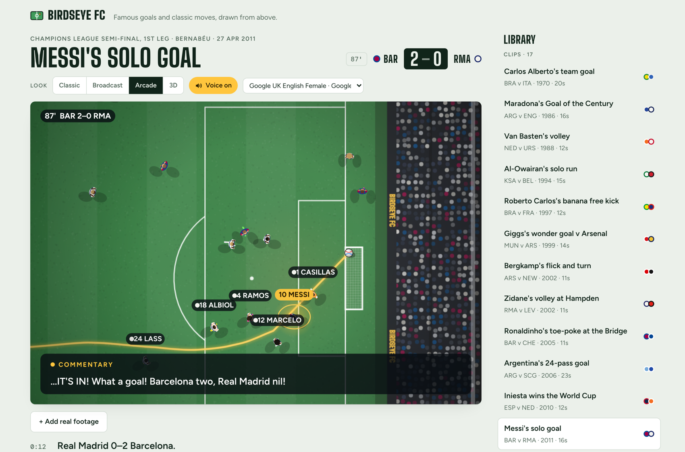
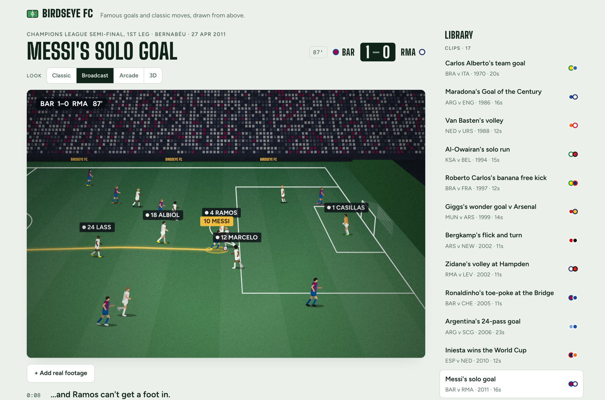
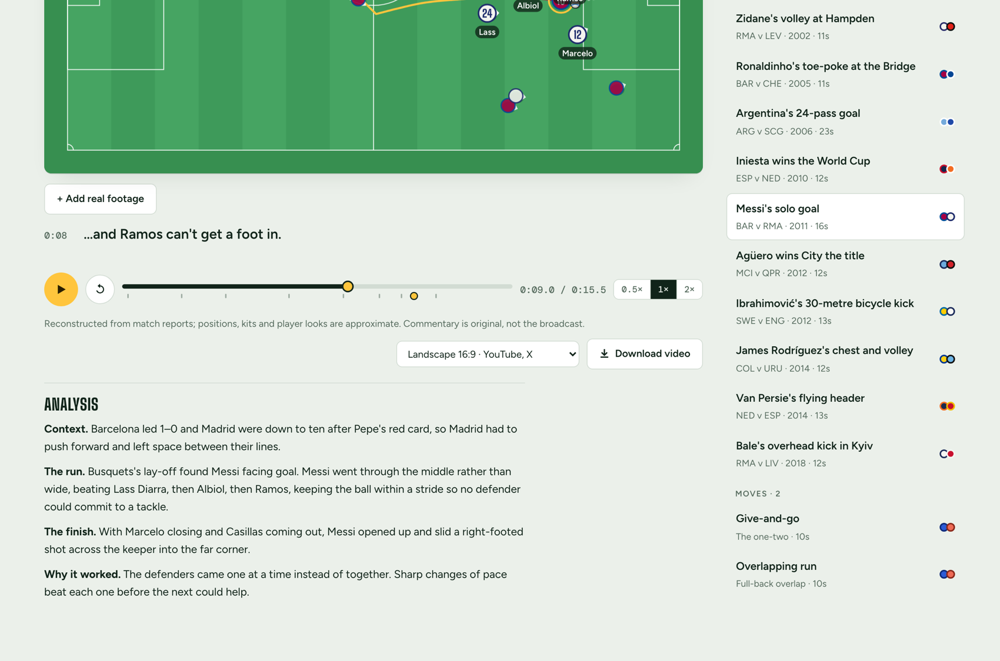

# Birdseye FC

Famous goals and classic moves, drawn from above.

Birdseye FC replays iconic football moments as stylised animations: every player runs, turns,
lunges and dives on a scale pitch, with original commentary read aloud over the top. Seventeen
clips ship with it, from Carlos Alberto in 1970 to Bale in Kyiv, plus two coaching moves.

**Live:** https://amalmehta.github.io/soccer_viz/



## What it does

- **Four looks, same play.** Classic (clean top-down), Broadcast (TV camera in the stands),
  Arcade (game-style chase camera) and 3D, switchable while a clip runs.
- **Real movement.** Players hold shape, mark, press, jockey and tackle; defenders track the ball
  and lunge for it rather than drifting. Speeds stay inside human limits.
- **Spoken commentary.** Written for this project — never the broadcast audio — read aloud by the
  best voice the browser offers, over a stadium crowd bed.
- **Period detail.** Kits, ball colour and stadium change with the year and the venue: floodlights,
  athletics track, roof, mowing pattern, crowd colours.
- **Analysis.** A short written breakdown under each clip: context, the move itself, why it worked.
- **Video download.** Export any clip as an MP4 in four aspect ratios (16:9, 9:16, 1:1, 4:5).
- **Real footage side by side.** Where the rights holder allows embedding, the original clip plays
  next to the animation, scrubbed in sync. Any YouTube link can be added by hand.
- **Installs and works offline.** Web app manifest plus a service worker, so it can be added to a
  phone home screen or a dock and still run with no network.





## Running it locally

```bash
python3 -m http.server 8777 --directory docs
```

Then open http://localhost:8777. No build step, no dependencies — it is plain HTML, CSS and
JavaScript. The 3D look loads Three.js from a CDN; everything else is local.

## Layout

| Path | What it is |
| --- | --- |
| `birdseye.html` | The whole app in one file: pitch model, motion engine, rendering, UI, voice, video export |
| `looks/` | The Broadcast, Arcade and 3D renderers (Classic lives in `birdseye.html`) |
| `library/plays/*.json` | One file per clip: players, paths, ball, actions, commentary, venue, analysis |
| `library/clips.js` | The bundled library the app loads, built from `library/plays/` |
| `sound/crowd.js` | Crowd bed and goal reaction, mixed live and into downloaded video |
| `docs/` | The built website — this is what GitHub Pages serves |
| `tools/check_plays.js` | Validator: timing, speeds, spacing, kits, wording, goal geometry |
| `tools/build_library.py` | Bundles `library/plays/*.json` into `library/clips.js` |
| `build_site.py` | Builds `docs/` from `birdseye.html` (icons, manifest, service worker) |
| `build_sounds.py` | Embeds the crowd recordings from `sound/recordings/` into the page |
| `soccer_viz.md` | The spec this was built from, with a changelog |

## Adding a clip

1. Write `library/plays/<year>-<name>.json` — copy an existing one for the shape.
2. Check it: `node tools/check_plays.js library/plays/*.json`
3. Bundle and rebuild: `python3 tools/build_library.py && python3 build_site.py`
4. Commit `docs/` along with the source; pushing to `main` publishes the site.

The checker rejects anything physically implausible (a 40 m/s pass, a 12 m/s sprint, players
standing inside each other), any goal whose ball misses the net, and any wording that uses
he/she instead of a name or a role.

## Accuracy and rights

Every clip is a reconstruction from match reports and memory: positions, kits and player
appearances are approximate, not tracking data. Commentary is written for this project and
is never a transcript of the original broadcast. No broadcast footage is copied or hosted —
real clips appear only as YouTube embeds, from the rights holders' own channels. The crowd
recordings are Creative Commons 0 from Freesound (credited in `build_sounds.py`).

Not affiliated with any club, league or broadcaster. Player names appear as factual reference
to public sporting events.
