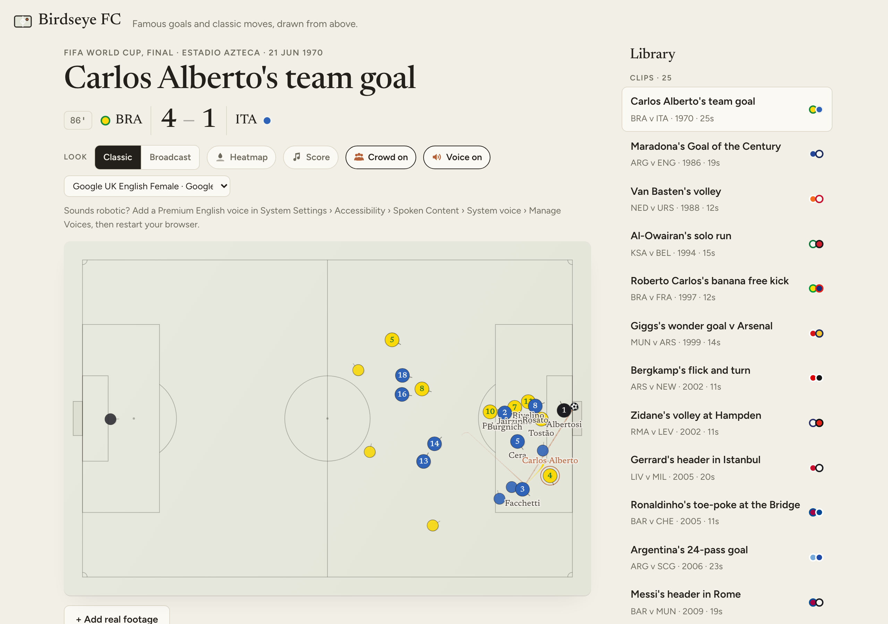

# Birdseye FC

Famous goals and classic moves, drawn from above: iconic football moments replayed as stylised
animations on a scale pitch, with original commentary read aloud over the top.

**[Instructions →](docs/INSTRUCTIONS.md)** · [File structure](docs/FILE-STRUCTURE.md) · [Live site](https://amalmehta.github.io/soccer_viz/)
