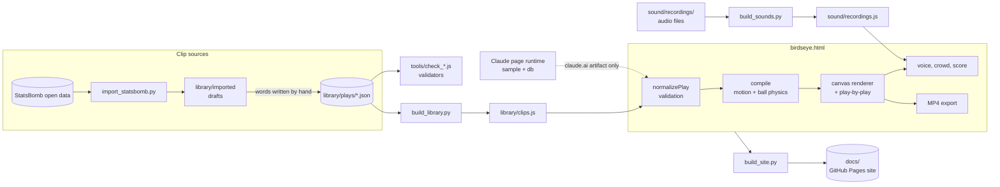
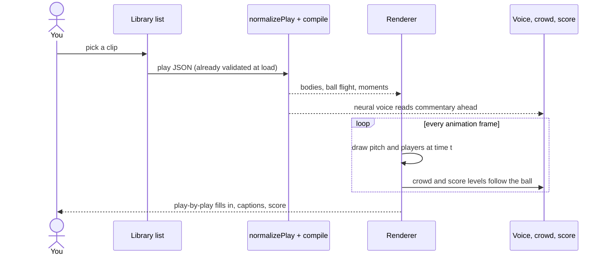

# System design

How Birdseye FC is put together. Back to the [README](../README.md) · [Instructions](INSTRUCTIONS.md) · [File structure](FILE-STRUCTURE.md)

## Overview

Birdseye FC is one HTML page that replays football moments from play files: each file gives players' keyframed
paths, the ball's touches, commentary and notes, and the page's engine fills in everything between them (strides,
turns, ball flight, defending) and draws it on a canvas. Python and Node tools build and check the clip library and
bake the page into an installable, offline website in `docs/`, which GitHub Pages serves.

## Components

| Part | What it does | Where |
|---|---|---|
| **Validation** | `normalizePlay` cleans any play (built-in, bundled or AI-made): clamps speeds and sizes, checks kits, events, actions, looks and footage IDs, and rejects what it can't repair. | `birdseye.html` (Validation section) |
| **Motion engine** | `compile` turns keyframes into bodies: off-ball movement and pressing, gait tables, footfalls that stay planted, actions (volleys, dives, tackles) and the keeper's angle-bisector position. | `birdseye.html` (Motion, Off-ball, Actions) |
| **Ball physics** | Solves for the strike that, under drag, gravity, spin (Magnus) and grass friction, lands the ball on the next keyframe on time. | `birdseye.html` (inside `compile`) |
| **Renderer** | Draws the pitch, venue, players from overhead, passing options, heatmap and play-by-play; marks reconstructed bodies faintly. | `birdseye.html` (Rendering, Playback + UI) |
| **Sound** | Commentary voice (system voices, or the Kokoro neural model loaded on demand), crowd mixed from a real recording, optional orchestral score. | `sound/voice.js`, `crowd.js`, `score.js`, `recordings.js` |
| **Video export** | Renders frames offline to H.264 MP4 with WebCodecs and mp4-muxer, with the sound mixed in; falls back to real-time `MediaRecorder`. | `birdseye.html` (Video download) |
| **Library tools** | Import a StatsBomb goal as a draft, bundle play files, re-time slow chasers. | `tools/import_statsbomb.py`, `build_library.py`, `quicken_chases.py` |
| **Checkers** | Load the page's own validator and engine into Node and test clips for realism. | `tools/check_*.js` |
| **Site builder** | Bakes the page into `docs/`: `index.html`, manifest, icons, a service worker, hashed asset URLs. | `build_site.py` |

## Main flows

**Play a clip**

**Add a clip.** Import a goal from StatsBomb (or copy an existing file), write the words over the TODOs, move it into
`library/plays/`, run the checkers, then `build_library.py` and `build_site.py`, and commit `docs/` with the source.
Pushing to `main` publishes the site.

**Animate a play (claude.ai only).** When the page runs as a published claude.ai artifact, a text description is sent
with a long format-and-rules prompt through the page's `sample` capability; the JSON reply goes through the same
`normalizePlay` and joins the library as "Yours this session". The standalone website has no such connection, so
`build_site.py` sets `BIRDSEYE_STANDALONE` and the panel and the feedback tab are hidden.

## Data and storage

| Data | Where | Notes |
|---|---|---|
| Clips | `library/plays/*.json`, bundled into `library/clips.js` | One file per clip; three more (a solo run and two moves) are built into the page. |
| Importer drafts | `library/imported/` | StatsBomb downloads are cached in `tools/.statsbomb-cache/` (ignored by git). |
| Audio | `sound/recordings.js` | Crowd and score as base64 AAC, so no audio is fetched at runtime; source files stay out of git. |
| Viewer settings | Browser `localStorage` (`birdseye.*`) | Voice, crowd, score, heatmap, passing options, video format, added footage links. |
| Feedback | The artifact's `db` (claude.ai page only) | Not available on the website. |
| Website | `docs/` | Rebuilt by `build_site.py`, which keeps `docs/*.md`, so these docs survive a rebuild. |

## Design decisions

- **One self-contained page.** The engine, renderer and UI share one file with no build step or dependencies,
  so it runs as a claude.ai artifact and as a static site. The cost: a file of several thousand lines.
- **Keyframes in, physics out.** Clips record only what is known (positions at moments, who has the ball); the
  engine reconstructs strides, turns and ball flight. Data stays small and hand-editable, but much of what's on
  screen is inferred, so the page draws inferred bodies faintly.
- **The checkers run the page's own code.** They slice sections out of `birdseye.html` by their comment markers
  and run them in Node, so tools and app can't disagree; renaming a marker breaks the checkers.
- **Embedded audio.** Base64 recordings make the page heavier but work offline and inside the claude.ai page.
- **Neural voice on request.** Kokoro runs in the browser (WebGPU or WebAssembly), so nothing leaves the
  machine, but it is an ~80 MB first download, so it loads only when chosen and falls back to the system voice.
- **Stale-while-revalidate service worker.** App files answer from cache and update in the background; hashed
  script URLs stop browsers reusing old copies after a rebuild.

## Testing

There is no unit-test suite or CI. Quality is held by the clip checkers, run by hand before bundling:
`check_plays.js` (the page's validator plus timing, speeds, spacing, kits, wording, goal geometry),
`check_motion.js`, `check_turn.js`, `check_glide.js`, `check_ball.js` and `check_press.js`. `tools/shot.js`
screenshots the running page with headless Chrome for visual checks.

## Limits

- Clips are reconstructions, not tracking data: positions, kits and looks are approximate, and between a half and
  a third of body-time is the engine's guess.
- StatsBomb data only places the player on the ball and those in the shot's freeze frame; the rest are placed once.
- Animating new plays and feedback work only on the published claude.ai page.
- Real footage appears only where the rights holder allows YouTube embedding.
- `build_sounds.py` uses macOS `afconvert`; PNG icons need Pillow (without it, only the SVG icon is built).
- Browsers without WebCodecs record video in real time, possibly as WebM.
