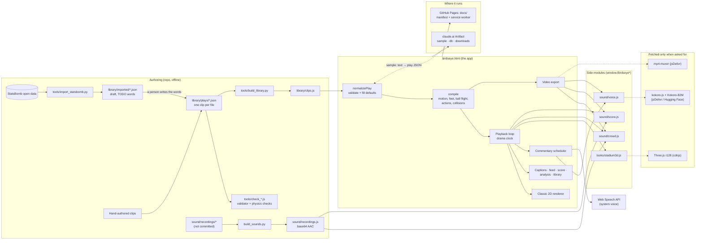
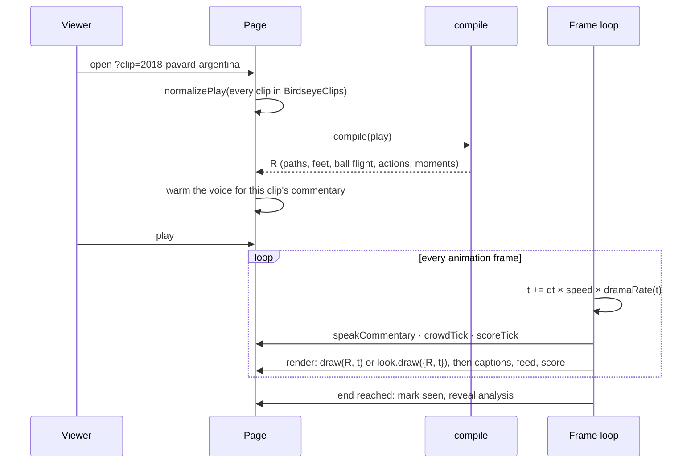

# System design

[← README](../README.md) · [Instructions](INSTRUCTIONS.md) · [File structure](FILE-STRUCTURE.md)

Birdseye FC is a static web app. There is no server and no database of its own: a clip is a JSON
file, the app is one HTML page, and everything a viewer sees — every body, every ball flight,
every line of spoken commentary — is computed in the browser from that JSON at load time. The
same page runs in two places: as a published Artifact on claude.ai, where it can borrow Claude
and a small shared database, and as a standalone website on GitHub Pages, where it installs as
an app and works offline.

## Architecture

## Components

### The app — `birdseye.html`

One file of about 5,800 lines: CSS, markup and a single IIFE. Its sections, in order:

| Section | Job |
| --- | --- |
| Pitch geometry | The 105 × 68 m pitch and goal mouth every other part measures against. Team A always attacks left to right. |
| Built-in plays | Messi 2011 and the two coaching moves (give-and-go, overlap), inline so the page works with no library at all. |
| Validation (`normalizePlay`) | The one gate every play passes through — library, generated or imported. Rejects what is malformed, clamps what is out of range, fills defaults (looks, venue, era), and slugs an `id`. |
| Motion | Turns sparse `[t, x, y]` keyframes into continuous paths: a time-aware cubic so speed is continuous across keyframes, capped at a human top speed of 9.6 m/s, smoothed, and extrapolated past either end. |
| Off-ball movement (`offBallPaths`) | Plays the game around the ball for anyone the clip does not choreograph, and for everyone once their own keys run out: zonal shape that slides with the ball, goal-side marking, the nearest defender pressing, a back line that moves as one, a keeper on the post-angle bisector. Speeds come from a set of gears that are chosen and held. Records `recordedUntil` per player — the moment the clip stops vouching for them. |
| Actions | Kicks, volleys, headers, lunges, slides, dives, celebrations: timing and a pose blended over the running gait. |
| `compile(play)` | Builds everything a frame needs, once per clip: gait tables, planted footfalls, the ball's flight, actions, collision avoidance between bodies, ball-through-body near misses, headings, the play-by-play `moments`, and a lazily built heat map. Returns the object every renderer reads (`R`). |
| Ball flight (inside `compile`) | Between two keyframes, solves for the strike — launch velocity and spin — that puts the ball on the next keyframe on time under drag, gravity, Magnus and rolling resistance, then simulates it, including bounces and the net. |
| Rendering | The Classic look: a cached pitch layer, then ink bodies seen from above (shoulders, head, arms, striding legs), the ball and its brush-stroke trail, name labels, optional heat map and passing options. Bodies past their `recordedUntil` are drawn faint. |
| Passing options | At any moment the ball is held, a race between the pass and every defender (0.25 s reaction, human acceleration) decides which team-mates were on, split by whether they sat inside the carrier's field of view. |
| Playback + UI | The animation loop, captions with a reading-time linger, the stakes line before and the consequence after, the live feed, ball speed reading, scoreboard, scrubbing and frame stepping. |
| Drama clock (`dramaRate`) | Time runs at match speed during the build-up, slows to 0.42 into the strike and 0.34 once the ball is in. Playback, voice and video all run on this clock rather than wall time. |
| Links | `?clip=<id>` in the address, one history entry per clip, Back/Forward move between clips. |
| Looks | Classic (built in) or any module in `window.BirdseyeLooks`; the choice is remembered. |
| Commentary voice | Picks the best available voice, splits lines into phrases with a delivery (rate, pitch, pause) set by how close the goal is, and schedules them so the goal call lands on the goal. Falls back from neural to the system voice. |
| Crowd / score | Ticks the two sound modules each frame and owns their buttons. |
| Real footage | Standalone site only: a YouTube embed beside the animation, scrubbed in sync with it. |
| Library | The clip list, search, "Yours" (generated plays), watched markers. |
| Animate a play | claude.ai only: sends a description plus the format spec to Claude through `sample`, then normalises the JSON that comes back. |
| Feedback | claude.ai only: a tab that writes to the Artifact's `db`. |
| Video export | Renders the clip offline to MP4 in four aspect ratios, with crowd, score and neural commentary mixed in. |
| Capabilities | Detects which host it is in and hides what that host cannot do. |

### Side modules

Each is a plain script that hangs one object on `window`, so the page works when any of them is
missing and the build only has to copy files.

| File | Exposes | Job |
| --- | --- | --- |
| `library/clips.js` | `BirdseyeClips` | The bundled library: every `library/plays/*.json` with its file name as `id`. Generated — never edit by hand. |
| `looks/stadium3d.js` | `BirdseyeLooks.stadium3d` | The Stadium 3D look. Loads Three.js from cdnjs on first use, builds a floodlit ground from the venue, and poses mannequins from the page's own `R.bodyAt`, so a lunge in 3D is the same lunge as in 2D. Contract: `{ label, ready, load(), draw({ ctx, w, h, t, R, live, api }) }`. |
| `sound/crowd.js` | `BirdseyeCrowd` | Crowd mood at any play time (murmur, swell, the silence at the strike, the roar), played live through an `AudioContext` and rendered identically into video through an `OfflineAudioContext`. |
| `sound/score.js` | `BirdseyeScore` | The optional orchestral bed, lifting toward goal and ducking under the voice. |
| `sound/recordings.js` | `BirdseyeCrowdAudio`, `BirdseyeScoreAudio` | The recordings themselves, base64 AAC, so no audio is fetched at runtime. Generated by `build_sounds.py`. |
| `sound/voice.js` | `BirdseyeVoice` | Kokoro-82M through kokoro-js, WebGPU or WebAssembly, entirely in the page. Renders lines to `AudioBuffer`s, caches them, warms the clip's commentary ahead of time, and hands whole rendered lines to the video export. |

### Build and authoring tools

| Tool | Job |
| --- | --- |
| `tools/import_statsbomb.py` | Turns a goal in StatsBomb open data into a draft play: the real ball path, the real order of events, and every player the shot's freeze frame places. Words, kits and venue come out as TODOs. Downloads are cached. |
| `tools/build_library.py` | Bundles `library/plays/*.json`, sorted by file name (which starts with the year), into `library/clips.js`. |
| `build_sounds.py` | Converts the local recordings to AAC with macOS `afconvert` and embeds them in `sound/recordings.js`. |
| `build_site.py` | Builds `docs/`: wraps the page in a full HTML document with meta tags, copies the modules with a content hash in each script URL, draws the icons, writes the manifest and a service worker whose cache name is a hash of the shell. Keeps any `*.md` in `docs/` across rebuilds. |
| `tools/check_plays.js` | The page's own validator (nothing may be silently dropped) plus realism: timing, speeds, spacing, kits and contrast, goal geometry, venue, analysis, and wording that names people rather than using pronouns. |
| `tools/check_motion.js`, `check_glide.js`, `check_turn.js`, `check_press.js`, `check_ball.js`, `check_flight.js` | Movement checks against the compiled clip: facing against travel, speed and change of pace, turn rate and flicker, defenders closing the ball, the ball never passing through a body, and no ball jumping across a keyframe. |
| `tools/quicken_chases.py` | Re-times defenders loitering behind the play into a chase. |
| `tools/shot.js` | Screenshots the running app in headless Chrome, for checking what it draws. |

## Main flows

### Opening and playing a clip

All of the cost is in `compile`, once per clip; each frame only samples what it built. Changing
clip, scrubbing or changing look never recompiles.

### Adding a clip to the library

1. Draft it — by hand, or with `import_statsbomb.py` for a match in the open data.
2. Write the words over the TODOs and move the file into `library/plays/`.
3. Run `check_plays.js` and the six movement checks; they load the page's own code, so they judge
   exactly what the browser will draw.
4. `tools/build_library.py`, then `build_site.py`.
5. Commit the source and `docs/`; pushing to `main` publishes the site.

### Animating a play from a description (claude.ai only)

The text goes to `window.claude.use("sample")` with a prompt that carries the whole play format.
The reply is JSON, passed through `normalizePlay` like any other play, given a unique `id`, added
to the library under "Yours", stored in `localStorage`, and opened. Links are stripped first: the
model cannot watch a video, so a pasted link alone is answered with a request for a description.

### Spoken commentary

Each line is split into phrases and each phrase given a delivery from the mood at that moment,
which rises as the goal approaches rather than lagging behind the crowd. Lines are queued against
the drama clock; a goal call jumps the queue and is dropped if it would arrive more than 1.4 s
late. With the neural voice, the clip's lines are synthesised ahead of time when it opens so they
start on cue; with the system voice they go straight to `speechSynthesis`.

### Exporting video

The renderer is pointed at an offscreen canvas (`withView`) and the clip is drawn frame by frame
at 30 fps on the drama clock, faster than real time. Frames are encoded to H.264 with WebCodecs
and muxed with mp4-muxer. Audio is rendered offline: the crowd and score through their
`OfflineAudioContext` paths, and commentary as pre-rendered neural lines placed by mapping each
line's play time to the frame that shows it, with the crowd ducked underneath. Browsers without
WebCodecs fall back to a real-time `MediaRecorder` capture. Inside claude.ai the file is handed to
the `downloads` capability; elsewhere it is an ordinary download link.

### Offline and updates (standalone site)

The service worker caches the shell on install and answers same-origin requests cache-first while
refreshing from the network; CDN files are network-first with the cache as fallback, so Three.js
and the voice model work offline once they have loaded once. The page checks for a new worker
every 30 minutes and shows an update bar rather than reloading under someone mid-clip.

## Where data lives

| Data | Where | Notes |
| --- | --- | --- |
| Clips (source of truth) | `library/plays/*.json` | One file per clip; the file name is the clip's id and its address. |
| Importer drafts | `library/imported/*.json` | Kept for reference; not loaded by the app. |
| Bundled clips | `library/clips.js`, `docs/library/clips.js` | Generated. |
| Built-in plays | Inline in `birdseye.html` | Messi 2011, give-and-go, overlap. |
| Audio | `sound/recordings.js` | Generated; originals in `sound/recordings/` are git-ignored. |
| StatsBomb downloads | `tools/.statsbomb-cache/` (ignored) | Two older matches are committed under `.statsbomb-cache/` at the root. |
| The website | `docs/` | Committed build output; GitHub Pages serves it from `main`. |
| Compiled clip (`R`) | Memory only | Rebuilt every time a clip is opened. |
| Neural voice model | Browser cache | ~80 MB, fetched on first use. |
| Synthesised lines | Memory (`Map` in `voice.js`) | Lost on reload. |
| Viewer preferences | `localStorage` | `birdseye.look`, `birdseye.videoFormat`, `birdseye.seen` (last 200), `birdseye.voice` / `voiceName` / `voiceOffer`, `birdseye.crowd`, `birdseye.score`, `birdseye.heat` / `heatWho`, `birdseye.options`, `birdseye.footage.<title>`. Per device; every access is wrapped so a blocked store only costs the memory. |
| Generated plays | `localStorage` `birdseye.mine` | Newest 12; the oldest are dropped when storage is full. |
| Feedback | The claude.ai Artifact's `db`, collection `feedback` | Text, clip title, timestamp. Not available on the standalone site. |
| App shell offline | Service worker cache `birdseye-<hash>` | Old caches deleted on activate. |

## Key decisions

- **One HTML file, no framework, no bundler.** The page has to run as a claude.ai Artifact and as a
  static site from the same source, and open by double-click. Modules are plain scripts on
  `window`, so a missing one degrades a feature instead of breaking the page.
- **Clips are sparse data; motion is computed.** A clip states where things were and when. How a
  body got there — stride, footfalls, turning, pressing, a ball under drag and spin — is the
  engine's job, so a clip is a few kilobytes and every clip benefits when the engine improves.
- **Solve for the cause, not the curve.** The ball's flight is solved from the strike that would
  produce it; passing lanes are a race between ball and defender, not a distance test. Constants
  are physical (drag, Magnus, rolling deceleration, reaction time) and the motion model was
  calibrated against open tracking data (Metrica, SkillCorner).
- **Say what is recorded and what is invented.** `recordedUntil` marks where a player's data ends;
  after that they are drawn faint. The passing options respect the same line.
- **One validator, shared by the page and the tools.** The checkers slice `birdseye.html` and run
  its own `normalizePlay` and motion code, so the tests cannot drift from what is drawn.
- **A drama clock instead of a fixed rate.** The strike and the goal are slowed inside the player
  rather than in the data, so no clip had to be re-timed, and voice and video follow the same clock.
- **Heavy things only on request.** Three.js (about 1 MB) and the voice model (about 80 MB) load the
  first time someone picks them; the first paint is always Classic with nothing fetched.
- **Audio embedded, not fetched.** The recordings are base64 in a script so the crowd works offline
  and inside the sandboxed claude.ai viewer, at the cost of a 1.3 MB file.
- **Two hosts, one page.** `window.BIRDSEYE_STANDALONE` and the presence of `window.claude` decide
  what shows: Claude-powered generation and feedback on claude.ai, footage embeds and offline
  install on the website.
- **Original words and no copied footage.** Commentary is written for the project; real clips appear
  only as YouTube embeds chosen by the viewer.

## Known limits

- **Clips are reconstructions.** Even imported clips track only the ball carrier and the players in
  the shot's freeze frame; a half to a third of all body-time is the engine's invention. StatsBomb
  360 frames carry no player identity and made motion worse when tried.
- **Generated plays get only the validator.** Clips made through "Animate a play" pass
  `normalizePlay` but none of the physics checks, so they can be less plausible than library clips.
- **The checkers depend on comment markers.** They find code by slicing between section headings in
  `birdseye.html`; renaming a heading breaks them.
- **Video export is untested by the tools.** None of the checkers exercise it, and it once failed
  silently for months. Any change to the renderer, drama clock or audio mix needs a real export.
- **`compile` rebuilds gait tables as it goes.** Foot positions are not stable mid-compile; anything
  cached from them must be keyed on endpoints, not on index.
- **The system voice cannot be put in a video.** Browsers do not expose its samples; only the
  neural voice is exported, and the export says so.
- **The neural voice is a big first download** and needs a CDN and Hugging Face the first time.
  Quality of the fallback depends entirely on the voices installed on the machine.
- **Stadium 3D needs the network once** and does not draw the heat map or passing options.
- **Generation and feedback exist only on claude.ai.** In that sandbox the History API throws, so
  clip addresses do not update there.
- **Preferences and generated plays are per device.** Nothing syncs; clearing site data loses them.
- **The site is committed build output.** Every module exists twice (source and `docs/`); forgetting
  `build_site.py` publishes the old copy.
- **`build_sounds.py` needs macOS** (`afconvert`).
- **One large file.** At ~5,800 lines, `birdseye.html` holds model, engine, renderer and UI together;
  sections are separated by convention only.
